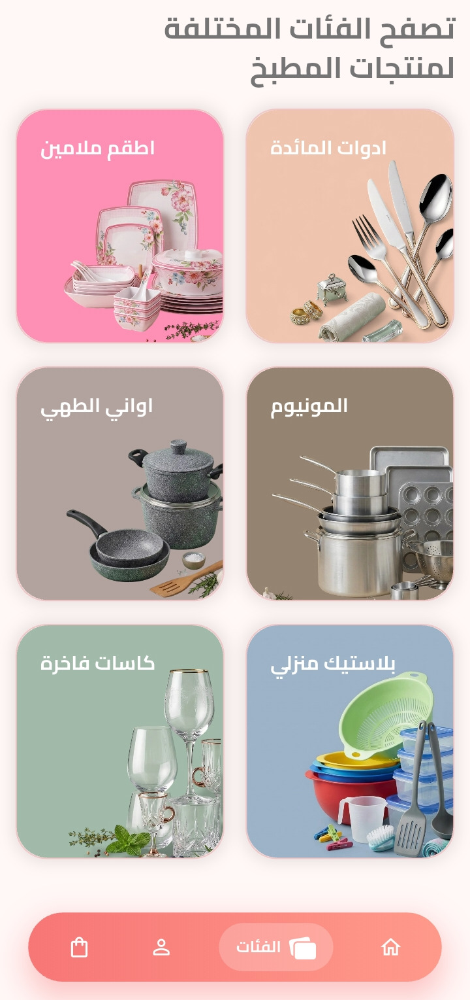

# 🛒 KitchenShop - E-Commerce App

<div align="center">
  <p>A production-ready, beautifully crafted, Arabic-first E-Commerce application built with Flutter.</p>
  <p>
    <strong>Offline-First • Smart Sync • WhatsApp Checkout • Hyper-Optimized</strong>
  </p>
</div>

---

> 🔒 **Note:** The source code for this project is proprietary and closed-source because it was developed for a private client. This repository serves purely as a portfolio showcase of the architecture, features, and user interface.

---

## 🎥 Video Demonstrations

### Onboarding & Custom Notifications
<div align="center">
  
</div>

---

## 📸 Screenshots

<div align="center">
  
  
  
</div>

<br>

<div align="center">
  
  
  
</div>

<br>

<div align="center">
  
  
  
</div>

---

## 🌟 Overview

KitchenShop is a fully featured e-commerce application tailored specifically for Arabic-speaking users. It relies on a rigorous **Feature-First architecture**, utilizing modern Flutter capabilities, **Riverpod** for predictable state management, **Supabase** for backend operations, and **Hive CE** for blazing-fast local caching.

This project isn't just another shopping app; it's engineered with deep technical consideration for **performance**, **offline accessibility**, and **creative problem-solving** (like our signature WhatsApp-Canvas checkout flow).

---

## 🧠 The "Smart" Features (What makes this app special)

### 📦 1. Product Module: Offline-First "Smart Sync"
Instead of fetching the entire database on every launch, the app employs a highly optimized **Delta Syncing Strategy**:
* **The First Run**: A "Full Sync" downloads all products and caches them locally using Hive.
* **Subsequent Runs**: The app performs a "Delta Sync", sending the `last_sync_time` to Supabase and downloading *only* the products that have been added, modified, or soft-deleted since the last session.
* **Offline Fallback**: If there’s no internet connection, the UI immediately falls back to the Hive cache, ensuring the app is always accessible and fast.
* **Soft Deletes**: Items marked `isDeleted` in the backend are silently removed from the local cache, preventing UI clutter without heavy database operations.

### 💳 2. Cart & Checkout: The WhatsApp Visual Receipt
Traditional payment gateways can be heavy and costly for small businesses. KitchenShop bypasses this entirely with a brilliantly simple "direct-to-owner" approach:
* **Canvas Rendering**: Using Flutter's `Canvas`, the `OrderImageGenerator` compiles the user's cart state into a beautifully formatted, physical-looking receipt **image**.
* **WhatsApp Integration**: The `WhatsAppOrderService` takes this high-quality rendered image and triggers a direct WhatsApp intent to the store owner. No complex backend checkout infrastructure required—just a direct, visual, and highly converting sales funnel.

### 3. Real-Time Push Notifications Integration
* **Firebase Cloud Messaging (FCM)** keeps users engaged with instant updates on new products or promotional discounts. 
* Background and foreground notifications are perfectly parsed to wake the app and navigate users seamlessly without interrupting the UI rendering thread.

### 🔍 4. Search: Culturally-Aware Arabic Normalization
Searching in Arabic can be tricky due to diacritics (tashkeel) and letter variations (e.g., أ, إ, ا). 
* **Arabic Normalizer**: A custom utility strips diacritics and normalizes Arabic characters in real-time, ensuring users find what they are looking for seamlessly, regardless of how they type it.
* **Fuzzy Filtering**: Instantly filters products directly from the local Hive cache for zero-latency search results.
* **Recent Searches**: Retains local search history for a better UX.

### 🏠 5. Home & UI: Scroll-Aware Rendering
The dashboard is packed with visually appealing carousels and product grids, but it performs flawlessly at 60/120fps.
* **Scroll-Paused Animations**: Through a global `NotificationListener<ScrollNotification>`, heavy operations (like autoplaying carousel sliders) are actively paused while the user is scrolling, freeing up the raster thread.
* **Lazy-Mounted Drawer**: The complex `AdvancedDrawer` is not just hidden; it is completely unmounted from the Widget tree when closed, ensuring zero background rendering overhead.
* **Invisible Element Bypassing**: `SliverPersistentHeader` components that fade out on scroll explicitly bypass their layout and build phases once opacity hits zero.

### ❤️ 6. Favorites, Auth & Onboarding Flows
* **Favorites (Memoized Derived State):** A dedicated `@riverpod` provider acts as a proxy for favorites logic, calculating intersections locally so it avoids massive jank drops previously caused by `build()` level filtering.
* **Streamlined Onboarding:** Launch screens gracefully orient first-time users before storing their initial preferences via cache layers. 
* **Integrated Authentication:** Flexible, secure multi-provider backend sign-ins securely implemented with Firebase infrastructure.

---

## 🛠 Tech Stack & Architecture

* **Framework:** Flutter (Dart)
* **State Management:** Riverpod 3.0 (`AsyncNotifier` & `Notifier`)
* **Backend:** Supabase (Database, APIs), Firebase (Auth, Cloud Messaging)
* **Local Storage:** Hive CE (Offline persistence)
* **UI/UX:** `flutter_screenutil` (responsive design), `flutter_animate` (micro-interactions)
* **Architecture:** Feature-First, Clean Architecture principles. 

### 🗂 Complete Project Structure
```text
lib/
├── core/
│   ├── animation_extensions.dart
│   ├── config.dart
│   ├── constants/
│   │   └── app_constants.dart
│   ├── network/
│   │   ├── http_overrides_io.dart
│   │   └── http_overrides_stub.dart
│   ├── providers/
│   │   ├── app_contacts_provider.dart
│   │   ├── hive_provider.dart
│   │   ├── notification_provider.dart
│   │   ├── repo_provider.dart
│   │   └── supabase_provider.dart
│   ├── services/
│   │   ├── notification_service.dart
│   │   ├── order_image_generator.dart
│   │   └── whatsapp_order_service.dart
│   ├── theme/
│   │   ├── app_colors.dart
│   │   └── app_theme.dart
│   └── utils/
│       ├── deep_link_handler.dart
│       └── whatsapp_helper.dart
├── features/
│   ├── account/
│   │   ├── account_screen.dart
│   │   ├── customer_requests/
│   │   │   ├── data/
│   │   │   │   ├── customer_profile_model.dart
│   │   │   │   ├── customer_request_model.dart
│   │   │   │   ├── customer_requests_provider.dart
│   │   │   │   └── customer_requests_service.dart
│   │   │   └── presentation/
│   │   │       ├── screens/
│   │   │       │   └── my_requests_screen.dart
│   │   │       └── widgets/
│   │   │           ├── customer_profile_form.dart
│   │   │           ├── new_request_bottom_sheet.dart
│   │   │           └── request_card.dart
│   │   └── favorites/
│   │       ├── data/
│   │       │   ├── favorites_provider.dart
│   │       │   └── favorites_service.dart
│   │       └── presentation/
│   │           └── screens/
│   │               └── favorites_screen.dart
│   ├── auth/
│   │   ├── data/
│   │   │   ├── auth_provider.dart
│   │   │   └── auth_service.dart
│   │   └── presentation/
│   │       └── widgets/
│   │           └── sign_in_bottom_sheet.dart
│   ├── cart/
│   │   ├── data/
│   │   │   ├── cart_provider.dart
│   │   │   └── models/
│   │   │       ├── cart_item_model.dart
│   │   │       └── cart_item_model.g.dart
│   │   └── presentation/
│   │       └── screens/
│   │           └── cart_screen.dart
│   ├── categories/
│   │   ├── data/
│   │   │   ├── apis/
│   │   │   │   └── category_api.dart
│   │   │   ├── models/
│   │   │   │   ├── category_model.dart
│   │   │   │   └── category_model.g.dart
│   │   │   └── repos/
│   │   │       └── category_repo.dart
│   │   └── presentation/
│   │       ├── providers/
│   │       │   └── category_provider.dart
│   │       ├── screens/
│   │       │   ├── categories_screen.dart
│   │       │   └── category_products_screen.dart
│   │       └── widgets/
│   │           ├── category_card.dart
│   │           └── category_grid.dart
│   ├── home/
│   │   ├── data/
│   │   │   ├── apis/
│   │   │   │   └── banner_api.dart
│   │   │   ├── models/
│   │   │   │   ├── banner_model.dart
│   │   │   │   ├── banner_model.g.dart
│   │   │   │   └── nav_item.dart
│   │   │   └── repos/
│   │   │       └── banner_repo.dart
│   │   └── presentation/
│   │       ├── providers/
│   │       │   └── banner_provider.dart
│   │       ├── screens/
│   │       │   └── home_screen.dart
│   │       ├── sections/
│   │       │   ├── discounted_section.dart
│   │       │   ├── new_arrivals_section.dart
│   │       │   ├── section_screen.dart
│   │       │   └── section_widget.dart
│   │       └── widgets/
│   │           ├── advanced_drawer_content.dart
│   │           ├── banner_widget.dart
│   │           ├── floating_nav_bar.dart
│   │           └── silverheader_widget.dart
│   ├── main_screen.dart
│   ├── onboarding/
│   │   ├── data/
│   │   │   └── repo/
│   │   │       └── onborading_repo.dart
│   │   └── presentation/
│   │       └── screens/
│   │           ├── loading_screen.dart
│   │           ├── onboarding1_screen.dart
│   │           ├── onboarding2_screen.dart
│   │           ├── onboarding3_screen.dart
│   │           ├── onboarding_notification_screen.dart
│   │           └── onboarding_tree.dart
│   ├── product/
│   │   ├── data/
│   │   │   ├── apis/
│   │   │   │   └── product_api.dart
│   │   │   ├── models/
│   │   │   │   ├── product_model.dart
│   │   │   │   └── product_model.g.dart
│   │   │   └── repos/
│   │   │       └── product_repo.dart
│   │   └── presentation/
│   │       ├── providers/
│   │       │   └── product_provider.dart
│   │       ├── screens/
│   │       │   └── product_screen.dart
│   │       └── widget/
│   │           ├── product_card.dart
│   │           └── product_grid.dart
│   └── search/
│       ├── data/
│       │   ├── recent_searches_service.dart
│       │   └── search_service.dart
│       ├── presentation/
│       │   ├── screens/
│       │   │   └── product_search_delegate.dart
│       │   └── widgets/
│       │       └── product_search_results.dart
│       └── utils/
│           └── arabic_normalizer.dart
├── firebase_options.dart
├── hive_registrar.g.dart
└── main.dart
```

---

## ⚡ Performance Triumphs

We treat Jank as a bug. Here is how KitchenShop maintains buttery-smooth scrolling:
1. **Strict Provider Scoping:** Global state listeners (like FCM init) are kept out of scrollable trees.
2. **Aggressive `RepaintBoundary` Usage:** Micro-animations (like a favoriting heart or adding to cart) heavily utilize `RepaintBoundary` so they do not trigger repaints of the entire scroll view.
3. **Slivers Everywhere:** Complete reliance on `CustomScrollView`, `SliverGrid`, and lazy-loading lists over standard ScrollViews for complex, multi-sectioned screens.

---

## 🚀 Getting Started

### Prerequisites
- Flutter SDK (`stable` channel recommended)
- Supabase Project & API Keys
- Firebase Project configured (for Auth & Messaging)

### Installation
1. **Clone the repository:**
   ```bash
   git clone https://github.com/yourusername/kitchenshop.git
   cd kitchenshop
   ```
2. **Install dependencies:**
   ```bash
   flutter clean && flutter pub get
   ```
3. **Generate Code (Crucial for Hive & Riverpod):**
   ```bash
   dart run build_runner build -d
   ```
4. **Environment Setup:**
   Ensure `env/env.json` and `lib/core/config.dart` are populated with your Supabase/Firebase credentials.
5. **Run the App:**
   ```bash
   flutter run
   ```

---

<div align="center">
  <i>Crafted with passion for performance, elegant code, and smooth user experiences.</i>
</div>
